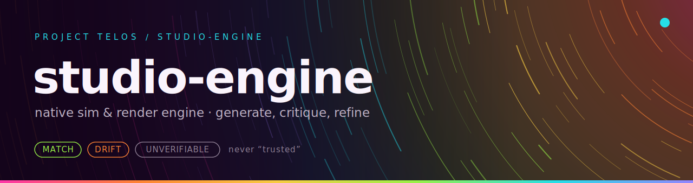

<p align="center"></p>

**A native simulation and render engine: generate, critique, refine, and keep the scene.**


Studio Engine generates shaders, sound, and motion as replayable creative worlds. A single expression algebra drives everything: each field ships as a WebGL fragment shader for the eye, a portable Web-Audio synth graph for the ear, and a motion timeline with time as a first-class axis. It runs on Python 3.10+ with zero third-party dependencies, exposing a CLI, a local HTTP API, and a reference browser chamber that compiles the shipped GLSL live. Every world writes a receipt you can re-check.

## Highlights

- **One algebra, every backend.** Each generator is a single `strand` expression. The engine emits it as a WebGL fragment shader, samples it to score criteria, sweeps it over time for motion, and grounds a Web-Audio synth graph against a baked WAV. The chamber renders the exact math the engine checked, not a re-implementation.
- **Real pixels without a GPU.** `--render-frames` drives a zero-dependency software rasterizer over the emitted program and writes deterministic PNG frames to disk, a strip across the loop period for animatable fields.
- **Watch it think, live.** `handoff/watch-it-think.html` streams the refine loop over Server-Sent Events and plots per-axis margins as they converge, with bounds-clamped sliders that steer parameters mid-run. Rejected steers are shown, never silently applied.
- **10 generators, one line each to extend.** phyllotaxis, gyroid, quasicrystal, attractor, harmonograph, flowfield, metaballs, turbulence, rings, moire. Field generators are one expression plus a criterion; `rings` and `moire` are each one line of algebra.
- **A compositor.** `POST /compose` layers multiple organs into one world under a shared composition criterion, with OKLab/OKLCh perceptual palettes across layers.
- **Motion as a first-class axis.** Every animatable world carries a Timeline with a witnessed verdict that the loop is seamless at the wrap point and stays legible across the period.
- **Interactive sessions.** Create a session over HTTP, inject parameter changes, and get the updated render program back each step. An optional bridge to a native C++ renderer reports honestly when the binary is not built.
- **Zero third-party dependencies.** The core engine is Python stdlib only. No pip install is needed to run it from a checkout.

## Try it

No install required from a clone:

```bash
python -m studio_engine 7 gyroid
```

Expected output (ids vary with the novelty corpus):

```
world e97b2c91d927bcaa | 'Gyroid #7'
  steps=7 converged=False final_score=0.0649
  render=glsl-fragment expr_sha=8a94af6a2eba5cb6
  timeline period=0.707566 continuity=verified
  palette=['#7375cb', '#8e7fd8', ...]
  wrote studio-out/world-7.json (+ svg preview + render program)
```

Or install the package, which adds a `studio-engine` command that starts the API server:

```bash
python -m pip install -e .
studio-engine
```

Start the API directly and open the reference chamber:

```bash
python -m studio_engine.server 8777
```

Then open `handoff/reference-chamber.html` in a browser. It compiles the shipped GLSL live, runs point recipes, stacks composites, and plays the synth graph. For live convergence plots and parameter steering, open `handoff/watch-it-think.html` instead.

## Worked example: from seed to PNG frames

```bash
python -m studio_engine --render-frames 7 gyroid
```

This runs the full loop, then rasterizes the emitted render program headlessly:

```
  rendered 8 PNG frame(s) -> studio-out/frames-7/ (+ frames.json)
```

`studio-out/` now holds the world JSON, an SVG preview, the GLSL render program as text, eight PNG frames sweeping the loop period, and a `frames.json` manifest binding each frame's sha256 to the program's `expr_sha256`. Before rendering, the rasterizer reconstructs the expression from the shipped AST, re-hashes it, and refuses to render on a hash mismatch. Open the PNGs in any viewer; the frames tile seamlessly across the period because the timeline verdict says they do.

## HTTP API

`python -m studio_engine.server [port]` serves on 127.0.0.1 (default port 8777, CORS open):

| Route | What it does |
|---|---|
| `POST /simulate` | run the loop, return a World |
| `GET /simulate/stream` | SSE: per-step events, then the world |
| `POST /compose` | layered composite World |
| `GET /generators`, `/library`, `/gallery` | discovery: generators, organs, pre-built scenes |
| `GET /scene/{id}`, `/scene/{id}/program`, `/scene/{id}/filmstrip` | cached worlds, drop-in render programs, per-step replay |
| `GET /audio/{id}.wav` | baked sonification |
| `POST /session`, `/session/{id}/inject`, `/session/{id}/render` | interactive steering and re-render |
| `POST /native/render` | direct native render bridge (reports honestly if the binary is absent) |

The `handoff/` directory is the frontend integration package: [INTEGRATION.md](handoff/INTEGRATION.md), `types.ts`, `openapi.json`, `ENDPOINTS.md`, examples, and both runnable chambers.

## Generators

| Generator | Channel | Criterion (it did not author) |
|---|---|---|
| `phyllotaxis` | points | golden-angle packing |
| `gyroid` | field | clean tiling (integer frequency) |
| `quasicrystal` | field | 5-fold aperiodic order |
| `attractor`, `harmonograph` | points | balance / coverage / complexity |
| `flowfield`, `metaballs`, `turbulence`, `rings`, `moire` | field | contrast / complexity |

Each entry in the registry is a declarative binding: parameter seed and bounds, criteria axes, a preview render, and a strand expression (fields) or a point recipe (points). Adding a generator means writing one expression.

## The strand substrate

The shader the browser compiles is not hand-written. The engine holds each field as a frozen AST, emits the GLSL `field()` body from it, and proves the round trip GPU-free: emit GLSL, parse it back, and check that the reparsed AST eval-matches the original to 1e-6 across every generator. The same AST is sampled on CPU to compute the features the criteria judge, and swept over `t` to build the motion timeline. One source of truth, four consumers.

## What's in the box

```
studio_engine/            the engine (stdlib only)
  strand/                 expr.py (frozen AST), glsl.py (emit + parse-back proof)
                          recipe.py (point recipes), webaudio.py (synth graph)
  model.py                the contract: World / Layer / RenderProgram / AudioProgram / Timeline
  engine.py               the loop          registry.py    the 10-generator data table
  compose.py              the compositor    temporal.py    the witnessed motion timeline
  criteria.py             composable criteria + cohesion   corpus.py   novelty grounding
  raster_renderer.py      headless software rasterizer (PNG frames)
  native_render.py        bridge to the optional native C++ renderer
  certify.py              external structural-fitness oracle (coherence-membrane)
  session.py              interactive steering              server.py   the HTTP API
  organs/                 generators, OKLab palettes, sonify, raster
handoff/                  frontend package: INTEGRATION.md, types.ts, openapi.json,
                          reference-chamber.html, watch-it-think.html, examples/
showcase/                 static showcase with its own fixtures and Node tests
```

## Why it matters

Generated art is usually a dead end: pixels with no structure a person or a later program can inspect. Studio Engine keeps the shader program, sound graph, motion timeline, criteria, and receipt together, so a generated world can be re-rendered, steered, and checked instead of admired once and lost.

`(seed, generator, scheme)` determines a world for a fixed novelty corpus: same input, same id and sha256s. Every world carries its full refine trajectory, the criteria it was judged against, and a receipt whose artifact hashes cover the JSON, the audio, and any rendered frames, so an experience can be replayed and re-checked later.

## Scope and maturity

This is a 0.2.0 engine, not a finished product. It emits render programs and evidence packets; browsers, GPUs, and audio hosts realize them. The immersive chamber is the frontend's build, from `handoff/`. The dependency-free native GPU renderer is a separate project that this engine bridges to optionally. APIs may still move before 1.0.

## Docs and related projects

- [USAGE.md](USAGE.md): the full local workflow, including the showcase.
- [docs/INTRODUCTION.md](docs/INTRODUCTION.md): concepts and a first-ten-minutes walkthrough.
- [handoff/INTEGRATION.md](handoff/INTEGRATION.md): build a frontend against the API.
- [docs/design/SUBSTRATE-MAP.md](docs/design/SUBSTRATE-MAP.md): the strand substrate design.
- Peers: [forum](https://github.com/HarperZ9/forum) (multi-agent orchestration), [accountable-surface](https://github.com/HarperZ9/accountable-surface) (live perceive/gate/actuate surface).

## For developers

```bash
python -m pip install -e .
python -m unittest discover -s tests        # 169 tests
node --test showcase/tests/*.test.mjs
python test_forward_delivery_contract.py
```

See [AGENTS.md](AGENTS.md) for the repo operating boundary and [CHANGELOG.md](CHANGELOG.md) for delivery history.

## License

AGPL-3.0-or-later, dual-license ready: the author retains copyright and commercial licenses are available.

**Zain Dana Harper**, small tools with explicit edges. Built with Claude Code; reviewed, tested, owned.

## What this believes

This tool is one lane of a family that holds a single belief steady across
every surface: knowledge open to anyone who can attain the means; acceptance
decided by external checks, never reputation; every result re-runnable;
honest nulls first-class; ownership earned by comprehension; learning woven
into the work. The full text lives in [CREDO.md](CREDO.md).
