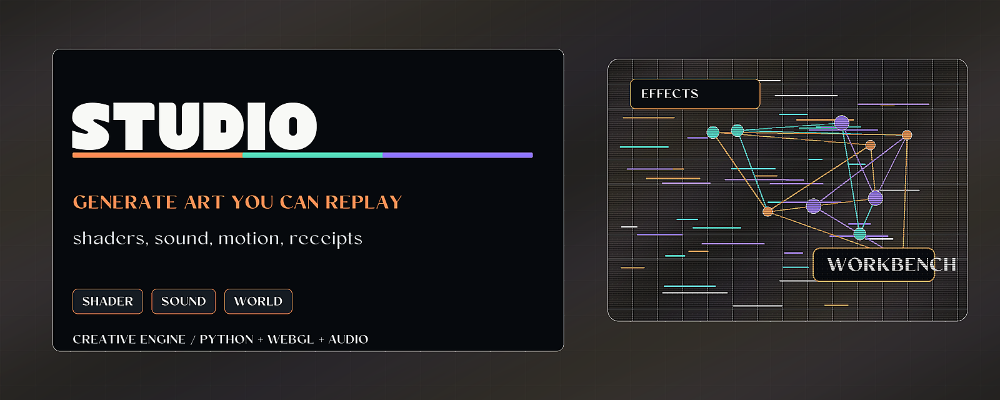

# studio-engine

<p align="center">
  
</p>

> Generate shaders, sound, and motion as replayable creative worlds.

## Try it

```bash
python -m studio_engine 7 gyroid
python -m studio_engine.server 8777
```

Then open `handoff/reference-chamber.html` in a browser.

## Why it matters

AI creative output is weak when the artifact has no structure a person or later model can inspect. Studio Engine keeps the shader program, sound graph, motion timeline, criteria, and receipt together, so a generated world can be replayed and checked.

## What to test first

- Generate a `gyroid` world and inspect the JSON, SVG preview, and render program.
- Serve the reference chamber and confirm the shipped GLSL compiles in the browser.
- Change the seed or generator and verify the output identity and receipt change with it.

## Current status

- **Runtime:** Python 3.10+; zero third-party runtime dependencies.
- **Surface:** CLI, local HTTP API, handoff package, reference browser chamber, WebGL shader payloads, WebAudio graph data, and replayable world receipts.
- **Scope:** Studio Engine emits programs and evidence packets. Browser, GPU, and audio hosts render those programs.

## Technical framing

> A native, **zero-dependency** creative-verification engine. It composes generative + verification
> organs into one witnessed loop and emits **Worlds** — self-describing render programs (GLSL for the
> eye, a synth graph for the ear), a witnessed motion timeline, and the reasoning trajectory — for an
> **experience-chamber** frontend to render.


Every World is a *witnessed creative act*: **perceive → generate → critique → refine → witness**.
The engine generates art, judges it against a criterion it did **not** author, refines toward
"correct," and records the whole replayable path with a re-checkable receipt. Grounded creativity
and verification as one loop — the accountability spine, turned toward making things.

## The strand substrate (what's new in 0.2.0)

One closed-form **expression algebra** (`strand`) is the single source every backend derives from —
so the chamber renders *the exact math the engine verified*, not a re-implementation:

- **eye** → the engine emits each field as a **WebGL fragment shader** (`render_program.source`); the
  frontend compiles it verbatim. The fragment's `field()` body *is* the verified expr.
- **ear** → a portable **Web-Audio synth graph** (`audio_program`), grounded against the baked WAV.
- **verify** → the engine samples the *same* expr to compute the features its criteria judge.
- **motion** → `t` is a first-class axis; a **Timeline** carries verdicts that the loop is seamless
  (no pop at the seam) and stays legible across the period.

The grounding is proved GPU-free: `AST → emit GLSL → parse → AST′` eval-matches the original to 1e-6,
for every generator. Adding a generator is now just writing one expr (`rings`, `moire` are one line each).

## Quick start (no install, stdlib only)

```bash
python -m studio_engine 7 gyroid           # run the loop, write studio-out/world-7.json (+ svg + program)
python -m studio_engine.server 8777        # serve the API at http://127.0.0.1:8777 (CORS *)
```

Then open `handoff/reference-chamber.html` in a browser — a runnable, **accessible** reference chamber
that compiles the shipped GLSL live, runs point recipes, stacks composites, and plays the synth graph.

## What's in the box

```
studio_engine/            the engine (zero-dep, stdlib only)
  strand/                 the substrate — one expression algebra, many backends
    expr.py               the frozen AST: eval, hash, sampling
    glsl.py               emit a GLSL fragment + parse it back (the grounding proof)
    recipe.py             point-cloud recipes (spiral / iterated / parametric)
    webaudio.py           the synth-graph backend
  model.py                the contract: World / Layer / RenderProgram / AudioProgram / Timeline
  engine.py               the loop + the 10-generator registry
  compose.py              the compositor — layered Worlds + a composition criterion
  temporal.py             the witnessed motion timeline (continuity + on-criterion)
  criteria.py             composable criteria + cohesion (harmonic mean)
  corpus.py               persistent novelty grounding
  organs/                 the resource library (each generator defines itself as a strand expr)
    program.py            assemble RenderProgram / AudioProgram from strand
    geometry · fields · flowfield · metaballs · turbulence · attractor · harmonograph · rings · moire
    palette.py            OKLab/OKLCh perceptual palettes · sonify.py · raster.py
  session.py              interactive cross-examine (steer the live render program)
  server.py               the HTTP API (http.server)
handoff/                  >>> the frontend package <<<
  INTEGRATION.md          read this first — how to build the chamber
  types.ts · openapi.json · ENDPOINTS.md · examples/ · reference-chamber.html
```

## Generators (10, extensible)

| Generator | Channel | Criterion (it didn't author) |
|---|---|---|
| `phyllotaxis` | points | golden-angle packing |
| `gyroid` | field | clean tiling (integer frequency) |
| `quasicrystal` | field | 5-fold aperiodic order |
| `attractor` · `harmonograph` | points | balance / coverage / complexity |
| `flowfield` · `metaballs` · `turbulence` · `rings` · `moire` | field | contrast / complexity |

Each is `(expr, criterion)`. Field generators emit a GLSL fragment; point generators emit a recipe.

## Determinism + receipts

`(seed, generator, scheme)` fully determines a World — same input, same `id` and `sha256`s (for a fixed
corpus). The receipt makes every experience reproducible and re-checkable. That honesty is the point.

## Honest scope

This is the **generation + verification** engine that *feeds* an experience chamber — real render
programs, real audio params, real witnessed reasoning. The chamber (the immersive room) is the
frontend's realization, built from `handoff/`. The engine emits a shader *as data* and verifies it on
CPU; the dependency-free **native GPU renderer** (no DirectX/driver) is `raw`'s separate telos — not
this package, named as the horizon this engine is built to later sit on.

## License

AGPL-3.0-or-later, dual-license-ready (the author retains copyright; commercial licenses available).
Matures the shipped sensory-algebra organs (contour/SVG, OKLab, render-critic, reconcile/refine) into
a composable, witnessed substrate.

**Zain Dana Harper** — small tools with explicit edges. Built with Claude Code; reviewed, tested, owned.
